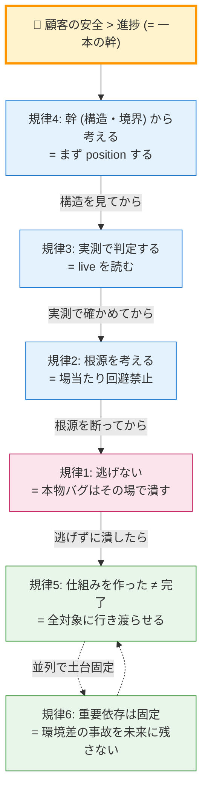

# engineering-doctrine-universal — 配布版・開発の思考様式ガード

> このスキルは [engineering-doctrine](../engineering-doctrine/SKILL.md) の **配布版 (= 第 2 層)**。
> 第 1 層 (= しろくま専用層) からは n=1 の経験則と固有スタック前提を剥き、**普遍核だけ**を残してある。
> 他の開発者 / 他のチーム / 他言語・他スタックでも、そのまま発火する設計。

> **位置付け (GOVERNANCE.md 準拠)**: しろくま自身の規律は engineering-doctrine が正典。本スキルはそこから業界配布用に蒸留した版。両者は **目的が違う** ので共存させる (= 第 1 層は濃く、第 2 層は薄く広く)。

---

## 思想 (= 一本の幹)

```
🌟 顧客の安全 > 進捗・効率・楽
   = 全ての判断の主語は顧客 (= 自分でも上司でもチームでもなく、エンドユーザー)
```

この一本の幹から、6 つの規律が伸びる。各規律は判断の異なる瞬間に発動する。

---

## 6 規律

### 規律 1: 逃げない (= Customer Safety First)

**「楽な道」「進捗確保」「タスク完了」を理由に本物のバグを放置しない。**

#### トリガー (思った瞬間に立ち止まる)

- 「`as any` / 型キャストで潰せば早い」
- 「段階 N で対応 / 後で潰す / 別タスク化」
- 「commit を区切るために今は触らない」
- 「`eslint-disable` / `@ts-ignore` / 番人迂回で隠れる」
- 「動いてるから OK」「実害なし」「backlog 化で OK」

#### 鉄則

- 本物のバグを見つけたら、**その commit / そのセッションで潰す**
- 例外は「物理的に今触れない明確な理由」のみ (= 稼働中の別環境 等)
- 「進捗確保 = 価値」と勘違いしない。タスク完了は手段、顧客の安全が目的

#### 業界用語対応

- "Customer Safety First" (任天堂 / Google SRE)
- "Don't make excuses for cutting corners" (SRE Book)

---

### 規律 2: 根源を考える (= Root Cause Analysis)

**問題が起きたら「今どう回避するか」でなく「なぜ起きたか (構造)」を突き止める。**

#### 行動ルール

1. エラー・詰まりに対し、**回避策を出す前に**「なぜ起きたか」を実機・ログ・既存記録で突き止める
2. **言い伝え・要約・前提 (「〜のはず」) を鵜呑みにしない**。実測で確かめる
3. 根源が分かったら **不変条件として明文化**し、誤った言い伝えは除去する

#### 業界用語対応

- **Five Whys** (Toyota Production System / 大野耐一)
- Root Cause Analysis (ITIL)
- "Don't paper over the cracks" (Jeff Atwood)

---

### 規律 3: 実測で判定する (= Trust but Verify)

**セキュリティ・権限・境界・本番設定の判定は、live の実体を読んで行う。推測禁止。**

#### なぜ

推測ベースの判定は **両方向に間違う**。偽陽性も偽陰性も同じ確率で出る。
偽陰性 = 穴を見逃す = 致命的。「たまたま安全側に外れた」では信用できない。

#### 行動ルール

- セキュリティ判定は **live を直読み** (DB なら実際の policy 条件式、設定なら実 env / 本番レスポンス)
- 古い設計書・baseline は信用しない。**現行形は live が唯一の真実**
- 重要判定は **trust but verify の多段** (別手段 / 別 Agent で独立に裏取り)
- 浅読みツール (read window が狭く推測で埋める Agent) に生命線の調査を投げない
- **計画・起案も一次資料 first** — 正典 doc・実コード・実 DB を読む前に、二次資料 (UI 文言・要約・引き継ぎ書) から計画を書かない。二次資料は誤解を複製する

#### 業界用語対応

- **Trust but verify** (Ronald Reagan → Google SRE)
- Evidence-based engineering (John Allspaw / Etsy)
- "In God we trust, all others must bring data" (W. Edwards Deming / TQM)

---

### 規律 4: 幹 (構造・境界線) から考える

**個別のバグ・負債・実装詳細に飛びつく前に、構造・境界線から position する。**

#### 行動ルール

- 見つけた項目は必ず「**どの境界・どの構造の症状か**」を位置づけてから動く
- 危険度は「**境界を侵しているか**」で測る (= 境界に無関係な掃除は最低優先)
- システムで一番大事なのは **境界線の構造**。機能・UI・負債掃除はその上に乗っているだけ
- 「視点が目の前すぎる」状態を自己検知する (= 戦術視点に堕ちてないか)

#### 業界用語対応

- **Bounded Context** (Domain-Driven Design / Eric Evans)
- "Architecture first" (Grady Booch / 4+1 View Model)
- Conway's Law (Melvin Conway 1967)

---

### 規律 5: 仕組みを作った ≠ 完了 (= Done is Done)

**新しい仕組み・設定・ルールを 1〜2 箇所に入れた時点で「完成」扱いにしない。全対象 × 全適用点に行き渡って初めて完了。**

#### なぜ

お手本を 1 個作ると「できた」と感じる (= 進捗で止まる)。だが仕組みは、全サービス・全画面・全経路で消費されて初めて価値になる。1 個で止めると残りが抜け落ち、「入れたはずの仕組みが効いていない」状態になる。

これは規律 1 の "進捗 = 価値と勘違いする" の横展開版。

#### 行動ルール

- 「仕組みを作る」と「全部を仕組みに乗せる」は **別作業**。両方やって初めて完了
- 横展開は「全対象に入ったか」を **マトリクスで確認** (= お手本 1 個で完了禁止)
- 検証は **本番の使われ方 (実利用経路)** で行う (= テスト経路で動いても、実利用経路で無効なら未完了)
- 設定 / フラグ / ブランド 等の「消費される値」は ①仕組みを作る ②全箇所で解決 ③全画面で消費 (ハードコード撲滅) を **別チェック** として全部やる

#### 業界用語対応

- **"Done is done"** (LinkedIn / Google)
- "Definition of Done" (Scrum / Agile)
- Rollout 完遂 / Feature flag 完全除去 (Continuous Delivery / Jez Humble)

---

### 規律 6: 重要依存は固定する (= Pin your dependencies)

**バージョンが揺れると壊れる依存は、範囲指定 (caret `^` / tilde `~`) をやめて完全固定する。**

#### なぜ

範囲指定は install のタイミングで実バージョンが変わりうる。型推論・ビルド・実行時挙動が **環境依存でブレる**。これは規律 1 の「逃げ」(= 楽だから今は触らない) が、未来に時限爆弾を残す形。

#### 行動ルール

- 壊れると痛い依存 (認証・暗号・決済・DB クライアント・AI SDK・フレームワーク本体) は範囲指定を解除して **完全固定**
- 複数サービスがあるなら、同じ依存のバージョンが **全サービスで揃っているか** 確認
- 固定したら塩漬けにせず、**定期 (例: 月次) に意図的アップグレード + 検証** をルーティン化 (= 固定 ≠ 放置)
- 「動くはず」で進めず、各対象の実バージョンを **事実確認**

#### 業界用語対応

- **Pin your dependencies** (Reproducible Builds 運動)
- Lockfile (package-lock.json / Cargo.lock / Pipfile.lock)
- Hermetic builds (Bazel / Google / Nix)

---

## 規律間の依存関係



「規律 1 が最重要」ではない。規律 4 で position しないと規律 1 を発動する場面すら認識できない (= 規律 4 が先・規律 1 が結果)。

---

## Intent Anchor (意図の先出し宣言) — 規律を発動させる前段装置

**6 規律は「発火すれば」効く。だが skill 遵守 ≠ skill 発火。** LLM の attention は目の前の Read 結果に引っ張られ (= perception hijack)、事後 self check は意思決定の後なので間に合わない。対策は **意思決定の前に意図を宣言して anchor する** こと:

```
【Intent Anchor】
- 目的 = (プロジェクトの北極星に 1 行で照合)
- 今回の scope = (触っていい file path / 機能を具体列挙・最大限狭く)
- scope 外発見時 = 触らない・記録のみ
```

- 新タスク受領の第 1 ターンは必須。scope が動いたと感じた瞬間も再宣言
- 「綺麗にする」等の抽象 scope は禁止 → file path / 機能名で具体化
- **配置が本体**: 毎ターン読まれる常時ロード位置 (プロジェクト CLAUDE.md 最上段) + Worker prompt 冒頭。skill にだけ書いても効かない

#### 業界用語対応

- Attention anchoring / Goal drift 対策 (LLM agent 運用)
- "Commander's Intent" (米軍ドクトリン — 実行前に意図を宣言し、現場判断の逸脱を防ぐ)

---

## 使い方 (= 発動チェックリスト)

実装・修正・調査・デバッグ・レビュー時、判断に迷ったら声に出して点検:

```
□ 規律0: ターン冒頭に Intent Anchor (目的 / scope 具体列挙 / scope 外 = 記録のみ) を出したか？
□ 規律1: いま「逃げ」のシグナルが出ていないか？ → 出ていたら本物バグをその場で潰す
□ 規律2: 回避策に飛びつく前に、根源を実測で突き止めたか？
□ 規律3: セキュリティ/設定の判定を推測でやっていないか？ live を読んだか？
□ 規律4: 個別項目に飛びつく前に、構造・境界から位置づけたか？
□ 規律5: 仕組みを1箇所だけ入れて完了にしていないか？ 全対象に実利用経路で行き渡ったか？
□ 規律6: 壊れると痛い依存を緩いバージョン指定のまま放置していないか？
```

すべて「目の前の進捗より本質」という一本の幹。

---

## 適用範囲 (= どんな開発で効くか)

本 6 規律は **言語・スタック・フレームワーク・チーム規模に依存しない**。以下のシナリオで適用可能:

| シナリオ | 効く規律 |
|---|---|
| 個人開発 (= solo developer) | 1 / 2 / 3 / 4 / 5 / 6 (全部) |
| 中小チーム (5-50 名) | 1 / 4 / 5 が特に強い (= 文化形成) |
| エンタープライズ (100+ 名) | 4 (Conway's Law) / 6 (Hermetic builds) が必須 |
| AI agent 経由開発 (Claude Code / Cursor / Aider 等) | **1 が最重要** (= AI は「楽な道」を選びがち) |
| OSS 開発 | 2 / 3 / 5 (= 公開コードの品質維持) |
| セキュリティクリティカル | 3 / 4 が中核 (= 境界 + 実測) |
| データプラットフォーム | 4 (Bounded Context) / 6 (Reproducible) |

---

## 哲学的位置付け

英語の `doctrine` は「教義」= 学派の中核思想。本 6 規律は単なるベストプラクティス集ではなく、**「顧客の安全 > 進捗」という価値判断を実装の各場面で再起的に適用する思想**。

近い思想:
- **Stoicism** (古代ストア派) — 「制御可能なものに集中する」(= 規律 4)
- **Bushido** (武士道) — 「逃げない」(= 規律 1)
- **Kaizen** (改善) — 「根源を断つ」(= 規律 2)
- **Toyota Way** — 14 Principles の統合 (= Five Whys + Bounded Stewardship)

これは技術書 (= How) ではなく **判断書 (= Why)** として扱う。判断に迷った時、6 規律を声に出すことで「目の前の進捗」と「本質」の二者択一を意識化する。

---

## ライセンス

MIT License (= プラグイン本体と同じ)。商用利用 OK / 改変 OK / 再配布 OK / 著作権表示のみ義務。

---

## 関連スキル

- [engineering-doctrine](../engineering-doctrine/SKILL.md) — 第 1 層 (= しろくま専用 n=1 経験則層)
- [doc-constitution](../doc-constitution/SKILL.md) — 文書運用憲法
- [staff-officer](../staff-officer/SKILL.md) — 参謀フロー (5 層 × 4 ライン)
- [session-operations](../session-operations/SKILL.md) — マルチセッション運用の型
- [GOVERNANCE.md](../../GOVERNANCE.md) — 第 1 層 ↔ 第 2 層 の継承統治
