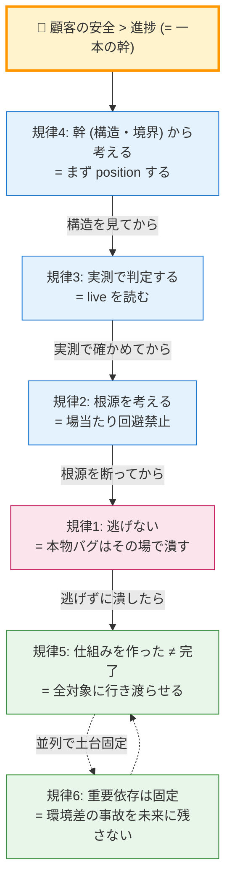

# engineering-doctrine — 開発の思考様式ガード

> ある開発現場で「何度も同じ指摘を受けて」固まった規律群。
> プロダクト固有の話は剥いてある。**どの開発でも効く判断軸**。
> 迷い・近道の誘惑・推測での判定 — これらが出た瞬間に立ち止まるためのチェックリスト。

この規律群は独立した教訓ではなく、**一本の幹から伸びた枝**だ。
幹 = 「**目の前の進捗より、本質と顧客の安全**」。各規律はそれを別々の方向から守る。
規律1〜4 が「判断の瞬間に立ち止まる」軸、規律5〜6 が「やり切る・固定する」軸。

---

## 規律1. 顧客の安全 > 効率・楽・進捗（逃げの検知）

**優先順位は常に「顧客（エンドユーザー）の体験の安全」が最上位。** 効率・楽・進捗・「commit を進めたい」は二位以下。

### 立ち止まるトリガー（思った瞬間に即停止）

以下が頭をよぎったら、それは**逃げのシグナル**。手を止めて本質に戻る:

- 「`as any` / type cast で潰せば早い」「型を黙らせれば進める」
- 「段階N で対応」「別タスク化」「先送り」「後で潰す」「#番号 を振っておく」
- 「commit を区切るために今は触らない」
- 「ノイズが多いから一気に握りつぶす」
- 「`ignoreBuildErrors` / lint 無効化 で隠れるから OK」

### 鉄則

- **本物のバグを見つけたら、その commit / そのセッションで潰す。** 別タスク化・次回送りは顧客への不誠実。
- 例外は「物理的に今触れない明確な理由」がある時のみ（例: 稼働中の別環境）。その場合も**理由を明示して記録**する。
- 「進捗確保」を「価値」と勘違いしない。タスク完了は手段、顧客の安全が目的。

> 判断軸の再固定（毎回意識）:
> 正しい軸 = **ユーザー体験・未来の安全・根本解決**
> 慣性で滑る軸（要警戒）= **タスク完了・進捗確保・段階化**
> ズレを感じたら立ち止まる。それが「もう一度考えよう」と言われる理由。

---

## 規律2. 根源を考える（場当たり回避の禁止）

**問題が出たら「今どう回避するか」でなく「なぜ起きたか（構造）」を突き止める。** 場当たりの回避は複数が絡み合って混線を生み、保守が高くつく。

### 行動ルール

1. エラー・詰まりに対し、**回避策を出す前に**「なぜ起きたか」を実機・ログ・既存記録で突き止める。
2. **言い伝え・要約・前提（「〜のはず」）を鵜呑みにしない。** 実測で確かめる（assumption 禁止）。
   - 「ドキュメントにそう書いてある」「前任者がそう言った」は仮説であって事実ではない。
3. 根源が分かったら**不変条件として明文化**し、誤った言い伝えは除去する。今回限りの回避で終わらせない。

> 典型的な失敗: ツールが失敗 →「権限/トークンが要るのだろう」と短絡 → 実は設定の不整合が真因だった。
> 「急に必要になるのはおかしい」という違和感を握りつぶさず、突き詰める。

---

## 規律3. 実測で判定する（推測でセキュリティを語らない）

**RLS・権限・境界・本番設定の「穴の有無」は、live の実体を読んで判定する。** ファイル名・関数名・古い設計書・件数からの推測は禁止。

### なぜ

推測ベースの判定は**両方向に間違う**。「穴あり」の偽陽性も、「問題なし」の偽陰性も同じ確率で出る。
偽陰性なら穴を見逃す = 致命的。たまたま安全側に外れただけでは信用できない。

### 行動ルール

- セキュリティの現状判定は **live を直読み**する（DB なら実際の policy 条件式、設定なら実際の env / 本番レスポンス）。
- baseline / 初期設計は古い。**現行形は live が唯一の真実**。後付けの変更は設計書に載っていない。
- **生命線の調査を「浅い読み」のツール/Agent に投げない。** 浅い読みは read window が狭く推測で埋める。実物読みが要るタスクは実体を SELECT/fetch する手段で。
- 重要判定は **trust but verify の多段**（別の手段・別 Agent で独立に裏取り）。一段の判定を鵜呑みにしない。

---

## 規律4. 幹（構造・境界線）から考える

**個別のバグ・負債・実装詳細に飛びつく前に、まず「構造・境界線」から position する。** バラバラのバグリストにしない。

### 行動ルール

- 見つけた項目は必ず「**どの境界・どの構造の症状か**」を位置づけてから動く。
- 危険度は「**境界を侵しているか**」で測る。境界に無関係な掃除（デッドコード・整形）は優先度最低。
- システムで一番だいじなのは**境界線の構造**。機能・UI・負債掃除はその上に乗っているだけ。
- 「視点が目の前すぎる」状態を自己検知する。一枚ずつ葉をむしる戦術視点に堕ちていないか。

> 「このユーザーが本当に欲しいのは何か」「課金/責任の主体は誰か」のような問いは、
> 目先の実装でなく**事業・システムの構造を俯瞰させるための促し**。問いの抽象度に合わせて視点を上げる。

---

## 規律5. 「仕組みを作った」≠「完了」（横展開を貫徹する）

**新しい仕組み・設定・ルールを1〜2箇所に入れた時点で "完成" 扱いにしない。** 全対象 × 全適用点に行き渡って初めて完了。

### なぜ

お手本を1個作ると「できた」と感じる（＝目の前の進捗で止まる）。だが仕組みは、全サービス・全画面・全経路で消費されて初めて価値になる。1個で止めると残りが抜け落ち、「入れたはずの仕組みが効いていない」状態になる。これは規律1の "進捗を価値と勘違いする" の横展開版。

### 行動ルール

- 「仕組みを作る」と「全部を仕組みに乗せる」は**別作業**。両方やって初めて完了。
- 横展開は「全対象に入ったか」を**マトリクスで確認**してから完了にする。お手本1個で完了にしない。
- **検証は本番の使われ方（実利用経路）で行う。** テスト用の経路で動いても、実利用経路で無効なら未完了。
- 「消費される値」（設定・ブランド・フラグ等）は ①仕組みを作る ②全箇所で解決する ③全画面で消費する（ハードコード撲滅）を**別チェックとして全部**やる。

> 参謀モードで横展開タスクを回す時の実務（マトリクス管理・Worker 配備）は [[staff-officer]] を参照。本規律はその思考の構え（正典）。

---

## 規律6. 重要依存は固定する（環境差の事故を未来に残さない）

**バージョンが揺れると壊れる依存は、範囲指定（caret `^` / tilde `~`）をやめて完全固定する。** 「動いてるから」で緩い指定を放置すると、別環境・別タイミングで実バージョンがズレて謎の事故になる。

### なぜ

範囲指定は install のタイミングで実バージョンが変わりうる。型推論の成否・ビルド・実行時挙動が**環境依存でブレる**。これは規律1の「逃げ」（楽だから今は触らない）が、未来に時限爆弾を残す形。

### 行動ルール

- 壊れると痛い依存（認証・暗号・決済・DB クライアント・AI SDK・フレームワーク本体）は範囲指定を解除して**完全固定**する。
- 複数サービスがあるなら、同じ依存のバージョンが**全サービスで揃っているか**を確認する（揃っていないと型保護もデプロイも環境依存の事故源）。
- 固定したら塩漬けにせず、**定期（例: 月次）に意図的アップグレード + 検証**をルーティン化する。固定 = 放置ではない。
- 「動くはず」で進めず、各対象の実バージョンを**事実確認**する（→ 規律3 実測）。

---

## 使い方（このスキルの発動）

実装・修正・調査・デバッグ・レビューに入る時、および上の各トリガーが出た時に、
該当規律を声に出して点検する:

```
□ 規律1: いま「逃げ」のシグナルが出ていないか？ → 出ていたら本物バグをその場で潰す
□ 規律2: 回避策に飛びつく前に、根源を実測で突き止めたか？
□ 規律3: セキュリティ/設定の判定を推測でやっていないか？ live を読んだか？
□ 規律4: 個別項目に飛びつく前に、構造・境界から位置づけたか？
□ 規律5: 仕組みを1箇所だけ入れて完了にしていないか？ 全対象に実利用経路で行き渡ったか？
□ 規律6: 壊れると痛い依存を緩いバージョン指定のまま放置していないか？
```

規律は連動する。規律4で構造を見て、規律3で実測し、規律2で根源を断ち、規律1で逃げずに潰す。
規律5で全対象にやり切り、規律6で土台を固定する。すべて「目の前の進捗より本質」という一本の幹。

---

## 規律間の依存関係

6 規律は独立の箇条書きではなく、**一本の幹から伸びた枝**で、判断時に順序を持って連動する:



**読み筋**:
- **規律 4 → 3 → 2 → 1**: 判断の流れ (= 構造で位置取り → 実測で裏取り → 根源を断つ → 逃げずに潰す)
- **規律 5 + 6**: やり切る・固定する軸 (= 1 件潰したら全対象に行き渡らせる + 土台を緩く放置しない)
- **すべて 🌟 顧客の安全 > 進捗 から派生**

「規律 1 が最重要」ではない。規律 4 で position しないと規律 1 を発動する場面すら認識できない (= 規律 4 が先・規律 1 が結果)。

---

## 業界用語マッピング

本 6 規律は独立の発明ではなく、**業界の名作 (Toyota / SRE / DDD / Lean 等) を「顧客の安全 > 進捗」の一本の幹で統合した実装**。既存業界用語を知っている人向けの対応表:

| 規律 | 業界の対応概念 | 出典 |
|---|---|---|
| **規律1: 逃げない** | "Customer Safety First" / "Don't make excuses for cutting corners" | 任天堂 / Google SRE / Site Reliability Engineering Book |
| | "If it hurts, do it more often" の逆方向 | Martin Fowler |
| **規律2: 根源を考える** | **Five Whys** (5 回「なぜ」を問う) | Toyota Production System (大野耐一) |
| | Root Cause Analysis (RCA) | ITIL / 故障解析の標準手法 |
| | "Don't paper over the cracks" | Jeff Atwood (Coding Horror) |
| **規律3: 実測で判定する** | **Trust but verify** | Ronald Reagan → Google SRE 文化に継承 |
| | Evidence-based engineering | John Allspaw (Etsy / Adaptive Capacity Labs) |
| | "In God we trust, all others must bring data" | W. Edwards Deming (TQM の父) |
| **規律4: 幹から考える** | **Bounded Context** | Domain-Driven Design (Eric Evans) |
| | "Architecture first" | Grady Booch / 4+1 View Model (Philippe Kruchten) |
| | Conway's Law (= 組織構造がアーキを規定する) | Melvin Conway 1967 |
| **規律5: やり切る** | **"Done is done"** | LinkedIn / Google エンジニアリング文化 |
| | "Definition of Done" | Scrum / Agile (= 完了条件の明示化) |
| | Rollout 完遂 / Feature flag 完全除去 | Continuous Delivery (Jez Humble) |
| **規律6: 依存固定** | **Pin your dependencies** | Reproducible Builds 運動 |
| | Lockfile (package-lock.json / Cargo.lock / Pipfile.lock) | Yarn / npm / Cargo / Pip 標準 |
| | Hermetic builds | Bazel (Google) / Nix |

**読み方**:
- 業界用語を知ってる人 → 「あぁ Five Whys + Bounded Context + Done is done を統合した規律ね」と一瞬で理解できる
- 業界用語を知らない人 → 規律本文だけで自己完結して学べる
- どちらの読者にも届く構造を意識した二層書き

**統合の独自性**:
- 個別の規律は業界に既存
- しかし「**顧客の安全 > 進捗**」という一本の幹で 6 規律を束ね、**判断の瞬間に立ち止まる順序 (= 規律 4 → 3 → 2 → 1 → 5/6)** を明示した実装は業界に類例なし
- これは Toyota Way 14 Principles の「考え方」を、ソフトウェア開発 + AI agent 経由運用に翻訳した版

---

## 哲学的位置付け (= なぜ "doctrine" なのか)

英語の `doctrine` は「教義」「ドクトリン」= 学派の中核思想。本 6 規律は単なるベストプラクティス集ではなく、**「顧客の安全 > 進捗」という価値判断を実装の各場面で再起的に適用する思想**。

近い思想:
- **Stoicism** (古代ストア派) — 「制御可能なものに集中する」(= 規律 4 で構造を見る)
- **Bushido** (武士道) — 「逃げない」(= 規律 1)
- **Kaizen** (改善) — 「根源を断つ」(= 規律 2)

これは技術書 (= How) ではなく **判断書 (= Why)** として扱う。判断に迷った時、6 規律を声に出すことで「目の前の進捗」と「本質」の二者択一を意識化する。
